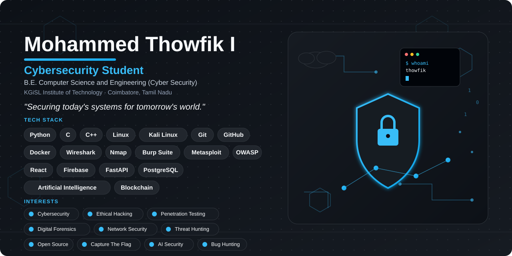

  <picture>
    <source media="(prefers-color-scheme: dark)" srcset="./dark.svg">
    <source media="(prefers-color-scheme: light)" srcset="./light.svg">
    
  </picture>

<h3 align="center">Building secure solutions through code, cybersecurity, continuous learning, and practical experimentation.</h3>

  <a href="https://github.com/thowfik2025">GitHub</a> ·
  <a href="https://www.linkedin.com/in/mohammed-thowfik-i-3b1ba0351/">LinkedIn</a>

---

## 👋 About

I'm **Mohammed Thowfik I**, a third-year **B.E. Computer Science and Engineering (Cyber Security)** student at **KGiSL Institute of Technology**, Coimbatore, Tamil Nadu, India (5th semester).

I'm working toward a career in security engineering, combining software development with hands-on cybersecurity practice.

## 🎯 Focus

- Cyber Security & Secure Development
- CTF / Cybersecurity challenges
- Digital Forensics
- AI Security
- SOC / Security Operations
- Cloud Security & DevSecOps
- Networking & Linux

## 🛡️ Cybersecurity Journey

- Studying B.E. CSE (Cyber Security) at KGiSL Institute of Technology
- Cybersecurity internship / project experience
- Participation in hackathons and CTFs
- Building projects across security, AI, IoT, and application development

## 🚀 Featured Projects

| Project | Description |
| --- | --- |
| **MTC Connect** | Transportation-focused application with live map/location and digital payment concepts |
| **SmartTrack** | Vehicle GPS tracking and monitoring project |
| **AI Negotiator** | AI-based negotiation project |
| **Internship Recommendation Engine** | System for recommending internships based on relevant information |
| **AI Student Project Evaluation** | AI-assisted evaluation concept for student projects |
| **Drug Inventory / Supply Chain Tracking** | Inventory and supply-chain tracking project |
| **Onion Storage IoT** | IoT-oriented onion storage/monitoring project |
| **Earth Defense** | Interactive Vite/React project |
| **Kolam Design Recognition** | Computer vision / recognition-oriented project |

## 🧰 Engineering / Security Stack

| Area | Technologies |
| --- | --- |
| **Languages** | Python · Java · C · SQL |
| **Systems & Security** | Linux / Kali Linux · Networking |
| **Web & APIs** | HTML · CSS · JavaScript · REST APIs · Firebase |
| **DevOps & Tools** | Git · GitHub · Docker · Jenkins · GitHub Actions · VirtualBox · VS Code |

## 🏁 CTF & Hackathons

Active participant in CTF and hackathon events, using them to practise security fundamentals and rapid, practical problem solving.

## 📈 GitHub Activity

  <picture>
    <source media="(prefers-color-scheme: dark)" srcset="https://github-readme-stats.vercel.app/api?username=thowfik2025&show_icons=true&hide_border=true&bg_color=0D1117&title_color=22D3EE&icon_color=7C3AED&text_color=E2E8F0">
    <source media="(prefers-color-scheme: light)" srcset="https://github-readme-stats.vercel.app/api?username=thowfik2025&show_icons=true&hide_border=true&bg_color=FFFFFF&title_color=2563EB&icon_color=0891B2&text_color=0F172A">
    
  </picture>

<h2 align="center">📊 GitHub Contributions</h2>

  <picture>
    <source
      media="(prefers-color-scheme: dark)"
      srcset="https://raw.githubusercontent.com/thowfik2025/github-snake/output/github-snake-dark.svg"
    />

    <source
      media="(prefers-color-scheme: light)"
      srcset="https://raw.githubusercontent.com/thowfik2025/github-snake/output/github-snake.svg"
    />

    
  </picture>

## 🤝 Connect

  <a href="https://github.com/thowfik2025"><b>GitHub</b></a> &nbsp;·&nbsp;
  <a href="https://www.linkedin.com/in/mohammed-thowfik-i-3b1ba0351/"><b>LinkedIn</b></a>

